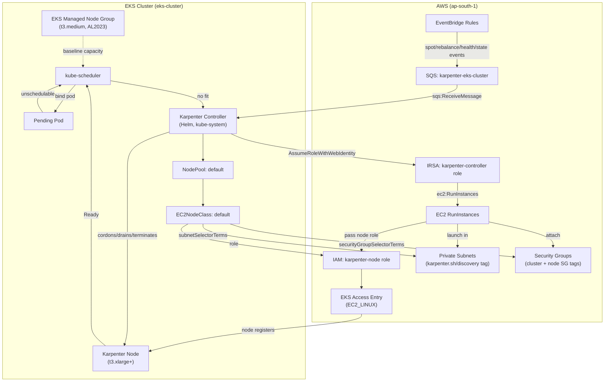
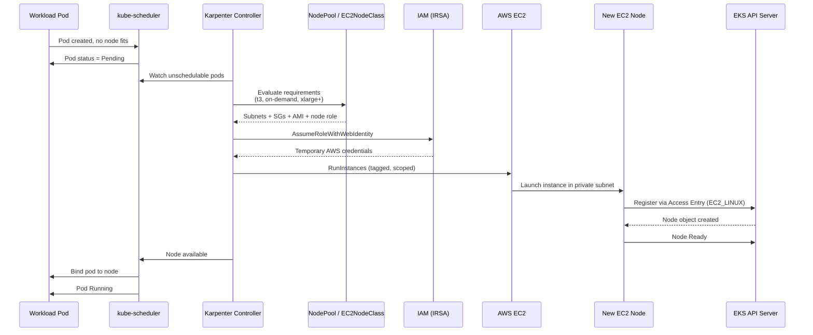

# deploy to different env

#Dev env
```bash
terraform init -backend-config=vars/dev.tfbackend
terraform apply -var-file=vars/dev.tfvars
``


#prod env
```bash
terraform init -backend-config=vars/prod.tfbackend
terraform apply -var-file=vars/prod.tfvars
``

# EKS k8s-services

Terraform module that deploys cluster add-ons and workloads on top of the EKS cluster provisioned in `EKS/core-cluster/`. This document focuses on the **Karpenter** autoscaling setup defined in this module.

## Karpenter in This Project

[Karpenter](https://karpenter.sh/) is a Kubernetes node autoscaler that provisions EC2 instances on demand when pods cannot be scheduled on existing capacity. In this repo, Karpenter is designed to **complement** the EKS managed node group (`t3.medium`, AL2023) defined in `EKS/core-cluster/eks.tf` by launching additional **burstable `t3` instances** (xlarge and above) when workload demand exceeds managed-node capacity.

Karpenter resources are defined in:

| File | Purpose |
|------|---------|
| `karpenter.tf` | Access entry, discovery tags, SQS/EventBridge, Helm chart, `EC2NodeClass`, `NodePool` |
| `iam.tf` | Controller IRSA role + node IAM role and policy attachments |
| `data.tf` | Cluster, VPC, private subnets, node security group, OIDC provider lookups |
| `variables.tf` | `karpenter_namespace`, `karpenter_sa`, `karpenter_version` |

### Current Terraform Status

> **All Karpenter AWS and Kubernetes resources are currently commented out** in `karpenter.tf` and the Karpenter section of `iam.tf`. Only the supporting **data sources**, **variables**, and the **kubectl provider declaration** in `versions.tf` remain active.

| Resource | Status |
|----------|--------|
| `aws_eks_access_entry.karpenter_node` | Commented out |
| `aws_ec2_tag.subnet_discovery` | Commented out |
| `aws_ec2_tag.cluster_sg_discovery` | Commented out |
| `aws_ec2_tag.node_sg_discovery` | Commented out |
| `aws_sqs_queue.karpenter` + policy | Commented out |
| EventBridge rules (4) + targets | Commented out |
| `aws_iam_role.karpenter_controller` + policy | Commented out |
| `aws_iam_role.karpenter_node` + attachments | Commented out |
| `helm_release.karpenter` | Commented out |
| `kubectl_manifest.ec2nodeclass_default` | Commented out |
| `kubectl_manifest.nodepool_default` | Commented out |
| Data sources (`aws_eks_cluster`, `aws_subnets.private`, etc.) | **Active** |
| Karpenter variables | **Active** |

To enable Karpenter, uncomment the resources in `karpenter.tf` and `iam.tf`, then apply this module after the core cluster is running.

---

## Architecture



### Cluster Context

The EKS cluster is created separately in `EKS/core-cluster/`:

- **Cluster name:** `eks-cluster` (default)
- **Version:** `1.31`
- **Region:** `ap-south-1`
- **VPC:** `eks-vpc-may26` with three private subnets tagged `kubernetes.io/role/internal-elb=1`
- **Managed node group:** `eks_nodes` — `t3.medium`, AL2023, min 2 / max 5 / desired 2
- **Add-ons:** CoreDNS, kube-proxy, vpc-cni, aws-ebs-csi-driver

The `k8s-services` module references this cluster via data sources and does not create the cluster itself.

---

## Key Components

### Karpenter Controller (Helm)

Deployed via `helm_release.karpenter` (commented out):

| Setting | Value |
|---------|-------|
| Chart | `oci://public.ecr.aws/karpenter/karpenter` |
| Version | `1.5.0` (`var.karpenter_version`) |
| Namespace | `kube-system` (`var.karpenter_namespace`) |
| ServiceAccount | `karpenter` (`var.karpenter_sa`) |
| Replicas | 1 |
| Resources | 200m CPU, 256Mi memory |
| IRSA annotation | `aws_iam_role.karpenter_controller.arn` |
| `settings.clusterName` | cluster name (see note below) |
| `settings.interruptionQueue` | `karpenter-${var.eks_cluster_name}` |

The controller watches pending pods, evaluates `NodePool` constraints, and calls the EC2 API to provision nodes. It also consumes interruption events from SQS for graceful node draining.

### EC2NodeClass (`default`)

Defines **how** nodes are launched:

- **AMI family:** AL2023 (`amiSelectorTerms: al2023@latest`)
- **Node IAM role:** `aws_iam_role.karpenter_node`
- **Subnet selection:** private subnets tagged `karpenter.sh/discovery = <cluster-name>`
- **Security group selection:** resources tagged `karpenter.sh/discovery = <cluster-name>` (cluster primary SG + managed node group SG)
- **Instance tags:** `karpenter.sh/discovery = <cluster-name>`

The `aws_ec2_tag` resources tag three targets so the selectors resolve:

1. All private subnets (`data.aws_subnets.private`)
2. EKS cluster primary security group
3. Managed node group security group (`data.aws_security_group.node`) — required so Karpenter nodes can reach pods on managed nodes (and vice versa)

### NodePool (`default`)

Defines **which** nodes Karpenter may create:

| Constraint | Value |
|------------|-------|
| `nodeClassRef` | `EC2NodeClass/default` |
| Capacity type | `on-demand` only (spot is commented out) |
| Architecture | `amd64` |
| OS | `linux` |
| Instance family | `t3` (matches managed node group family) |
| Instance sizes | **Not** `small`, `medium`, or `large` → effectively `xlarge` and above |
| `expireAfter` | `720h` (30 days) |
| CPU limit | `100` cores cluster-wide |
| Consolidation | `WhenEmptyOrUnderutilized`, after `1m` |

Previous constraints for `c`/`m`/`r` instance categories and generation `> 2` are commented out in favor of `t3` to align with the managed node group in `core-cluster/eks.tf`.

### SQS Interruption Queue

`aws_sqs_queue.karpenter` (`karpenter-eks-cluster`) receives EC2 lifecycle and health events via four EventBridge rules:

| Rule | Event |
|------|-------|
| `spot_interruption` | EC2 Spot Instance Interruption Warning |
| `rebalance` | EC2 Instance Rebalance Recommendation |
| `scheduled_change` | AWS Health Event |
| `instance_state_change` | EC2 Instance State-change Notification |

The controller reads these messages and proactively cordons/drains nodes before forced termination.

### IAM Roles

#### Controller role (`karpenter-controller-eks-cluster`) — IRSA

Assumed by the `karpenter` ServiceAccount via the cluster OIDC provider. Scoped permissions include:

- EC2: `RunInstances`, `CreateFleet`, `TerminateInstances`, `CreateTags`, describe APIs
- IAM: `PassRole` to the node role; create/tag/delete instance profiles
- SQS: receive/delete messages on the interruption queue
- EKS: `DescribeCluster`
- SSM/Pricing: AMI and pricing lookups

All EC2 write actions are scoped by cluster tags (`kubernetes.io/cluster/<name>=owned`, `eks:eks-cluster-name`) and Karpenter nodepool tags.

#### Node role (`karpenter-node-eks-cluster`) — EC2 instance profile

Assumed by Karpenter-launched EC2 instances. Attachments:

- `AmazonEKSWorkerNodePolicy`
- `AmazonEKS_CNI_Policy`
- `AmazonEC2ContainerRegistryReadOnly`
- `AmazonSSMManagedInstanceCore`

Registered with the cluster via `aws_eks_access_entry.karpenter_node` (type `EC2_LINUX`) — the EKS 1.33+ access-entry model replaces the legacy `aws-auth` ConfigMap for node join.

### Discovery Tags

| Tag key | Tag value | Applied to |
|---------|-----------|------------|
| `karpenter.sh/discovery` | `eks-cluster` | Private subnets, cluster SG, node SG, EC2 instances |

---

## Provisioning Flow (Step by Step)



### Interruption / Disruption Flow

1. AWS emits a spot interruption, rebalance, health, or state-change event.
2. EventBridge rule forwards the event to the SQS queue.
3. Karpenter controller receives the SQS message.
4. Controller cordons the affected node and evicts/drains workloads.
5. For consolidation (`WhenEmptyOrUnderutilized`), Karpenter also removes underutilized nodes after the `1m` consolidate delay, respecting the `100` CPU limit and `720h` expiration.

---

## Integration with This Repo

```
EKS/
├── core-cluster/          # VPC, EKS cluster, managed node group (always on)
│   ├── eks.tf
│   ├── network.tf
│   └── iam.tf
└── k8s-services/          # Add-ons including Karpenter (currently disabled)
    ├── karpenter.tf
    ├── iam.tf
    ├── data.tf
    └── variables.tf
```

**Dependency chain** (when uncommented):

1. `core-cluster` must be applied first — provides the EKS cluster, VPC, subnets, OIDC provider, and managed node group.
2. `k8s-services` data sources look up the running cluster and network resources.
3. IAM roles and access entry are created.
4. Discovery tags are applied to subnets and security groups.
5. SQS queue and EventBridge rules are created.
6. Helm installs the Karpenter controller with IRSA.
7. `kubectl_manifest` applies `EC2NodeClass` then `NodePool` (kubectl provider avoids CRD plan-time errors).

**Providers used by this module:**

| Provider | Purpose |
|----------|---------|
| `aws` | IAM, SQS, EventBridge, EC2 tags, access entry |
| `helm` | Karpenter controller chart |
| `kubernetes` | Other add-ons (ALB controller, monitoring, etc.) |
| `kubectl` | `EC2NodeClass` and `NodePool` CRs (declared in `versions.tf`) |

---

## Configuration Reference

| Variable | Default | Description |
|----------|---------|-------------|
| `eks_cluster_name` | `eks-cluster` | Target EKS cluster |
| `vpc_name` | `eks-vpc-may26` | VPC for subnet/SG lookups |
| `region` | `ap-south-1` | AWS region |
| `karpenter_namespace` | `kube-system` | Helm release namespace |
| `karpenter_sa` | `karpenter` | Controller ServiceAccount name |
| `karpenter_version` | `1.5.0` | Helm chart version |

### Known Issue When Enabling

The commented `EC2NodeClass`, `NodePool`, and Helm `settings.clusterName` reference `var.cluster_name`, but `variables.tf` only defines `var.eks_cluster_name`. Uncommenting requires replacing `var.cluster_name` with `var.eks_cluster_name` (or adding a `cluster_name` variable).

Additionally, a `provider "kubectl"` block is not defined in `providers.tf`; add one (mirroring the `kubernetes` provider credentials) before applying the `kubectl_manifest` resources.

---

## Enabling Karpenter

1. Uncomment all resources in `karpenter.tf` and the Karpenter section of `iam.tf`.
2. Fix `var.cluster_name` → `var.eks_cluster_name` in `karpenter.tf`.
3. Add a `kubectl` provider configuration to `providers.tf`.
4. Ensure the core cluster is running: `cd EKS/core-cluster && terraform apply`.
5. Apply this module: `cd EKS/k8s-services && terraform apply`.
6. Verify:

```bash
kubectl get nodepool,ec2nodeclass
kubectl logs -n kube-system -l app.kubernetes.io/name=karpenter
```

Create a test deployment with resource requests that exceed managed-node capacity to confirm Karpenter provisions `t3.xlarge+` nodes.
