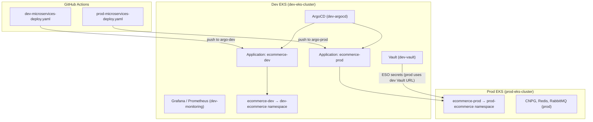

# Exercise: Multi-Environment EKS Deployment

This exercise walks through the **dev + prod** ecommerce platform under `multi-env-eks-stuff/`. You will learn how Terraform, ArgoCD, Vault, and GitHub Actions work together across two separate EKS clusters while sharing a single platform layer on dev.

---

## Learning goals

By the end of this exercise you should be able to:

1. Explain why dev and prod are **separate EKS clusters** with **separate Terraform state**.
2. Deploy infrastructure in the correct order (core → platform → app).
3. Describe how **one ArgoCD instance on dev** manages workloads on **both** clusters.
4. Trace a code change from **GitHub Actions → ECR → Git branch → ArgoCD sync → running pods**.
5. Tear down both environments safely.

---

## Architecture overview



### Key design decisions

| Topic | Dev | Prod |
|-------|-----|------|
| EKS cluster | `dev-eks-cluster` | `prod-eks-cluster` |
| Workload namespace | `dev-ecommerce` | `prod-ecommerce` |
| ArgoCD | Runs here | Not installed |
| Vault / Grafana | Runs here | Connects to dev over HTTPS |
| Terraform `env` | `dev` | `prod` |
| Git branch for Helm values | `argo-dev` | `argo-prod` |
| ECR repo prefix | `dev-ecommerce-*` | `prod-ecommerce-*` |
| Frontend URL | `shop-dev.devopsdozo.livingdevops.org` | `shop.devopsdozo.livingdevops.org` |

**Platform env** (`platform_env = dev`) means shared services (ArgoCD, Vault, monitoring, ACM wildcard cert) are deployed only when `env == dev`. Prod Terraform skips those and reuses the dev platform URLs.

---

## Repository layout

```
multi-env-eks-stuff/
├── EKS/
│   ├── core-cluster/          # VPC + EKS cluster (one apply per env)
│   └── k8s-services/          # ArgoCD, Vault, ESO, CNPG operator, ALB controller, monitoring
├── eks-microservices/
│   ├── environments/
│   │   ├── dev/value.yaml     # Helm values — updated by CI on argo-dev
│   │   └── prod/value.yaml    # Helm values — updated by CI on argo-prod
│   ├── helm-services/         # Services-only Helm chart (no DBs)
│   └── infra/
│       ├── ms-ecom/           # Namespace, DBs, ingress, Route53, ArgoCD Apps, cluster registration
│       └── observability/     # Optional PodMonitors / Grafana dashboards
└── destroy-dev.sh             # Tear down prod then dev (reverse deploy order)
```

Each Terraform module uses **separate S3 state keys** per environment, for example:

| Module | Dev state key | Prod state key |
|--------|---------------|----------------|
| `core-cluster` | `eks-may-2026/dev/ms/terraform.tfstate` | `eks-may-2026/prod/ms/terraform.tfstate` |
| `k8s-services` | `eks-may-2026/dev/multienv-k8s-services/...` | `eks-may-2026/prod/multienv-k8s-services/...` |
| `ms-ecom` | `eks-may-2026/dev/ms-ecom/...` | `eks-may-2026/prod/ms-ecom/...` |

Configure backends with `terraform init -backend-config=vars/<env>.tfbackend`.

---

## Part 1 — Deploy infrastructure

Apply each layer **for dev first**, then repeat for prod. Region: `ap-south-1`.

### Step 1: EKS core cluster

```bash
cd EKS/core-cluster
terraform init -backend-config=vars/dev.tfbackend -reconfigure
terraform apply -var-file=vars/dev.tfvars

# Repeat for prod
terraform init -backend-config=vars/prod.tfbackend -reconfigure
terraform apply -var-file=vars/prod.tfvars
```

Creates per env:

- VPC (`dev-eks-vpc-may26` / `prod-eks-vpc-may26`)
- EKS cluster (`dev-eks-cluster` / `prod-eks-cluster`)
- Managed node group (AL2023, `t3.medium`)

**Prod note:** `argocd-connectivity.tf` opens prod cluster API port 443 from dev node security groups so ArgoCD on dev can reach prod.

### Step 2: Kubernetes platform services

```bash
cd EKS/k8s-services
terraform init -backend-config=vars/dev.tfbackend -reconfigure
terraform apply -var-file=vars/dev.tfvars

terraform init -backend-config=vars/prod.tfbackend -reconfigure
terraform apply -var-file=vars/prod.tfvars
```

On **dev** this installs:

- AWS Load Balancer Controller
- CNPG operator
- Vault + External Secrets Operator
- ArgoCD (`https://argocd.devopsdozo.livingdevops.org`)
- kube-prometheus-stack + Grafana
- Wildcard ACM cert for `*.devopsdozo.livingdevops.org`

On **prod**, platform Helm releases are skipped; prod only gets cluster-scoped add-ons it needs (ALB controller, CNPG, ESO pointing at dev Vault).

### Step 3: Ecommerce app infrastructure (`ms-ecom`)

Apply **once per cluster**:

```bash
cd eks-microservices/infra/ms-ecom
terraform init -backend-config=vars/dev.tfbackend -reconfigure
terraform apply -var-file=vars/dev.tfvars

terraform init -backend-config=vars/prod.tfbackend -reconfigure
terraform apply -var-file=vars/prod.tfvars
```

| Resource | Managed by | Notes |
|----------|------------|-------|
| Namespace | Terraform | `dev-ecommerce` / `prod-ecommerce` |
| CNPG, Redis, RabbitMQ | Terraform | Credentials in Vault via ESO |
| ALB ingress + Route53 | Terraform | Helm ingress disabled in ArgoCD |
| Vault KV paths | Terraform | `secret/ecommerce/<env>/...` |
| ECR repositories | Terraform | `dev-ecommerce-*` / `prod-ecommerce-*` |
| ArgoCD Applications | Terraform (dev apply only) | `ecommerce-dev` + `ecommerce-prod` |
| Prod cluster registration | Terraform (dev apply only) | `argocd-cluster.tf` — RBAC + cluster secret |

When you apply **dev** `ms-ecom`, Terraform also:

1. Creates `argocd-manager` RBAC on the **prod** cluster.
2. Stores a cluster secret in `dev-argocd` named `prod-eks-cluster`.
3. Points the `ecommerce-prod` Application at the prod API endpoint.

### Step 4 (optional): Observability

```bash
cd eks-microservices/infra/observability
terraform init
terraform apply
```

---

## Part 2 — Responsibility split

Understanding **who owns what** prevents fighting between Terraform and ArgoCD.

| Layer | Owner | Location |
|-------|-------|----------|
| VPC, EKS, nodes | Terraform | `EKS/core-cluster/` |
| ArgoCD, Vault, operators | Terraform | `EKS/k8s-services/` |
| Databases, cache, broker | Terraform | `ms-ecom/databases.tf` |
| Ingress, DNS | Terraform | `ms-ecom/ingress.tf`, `route53.tf` |
| Microservice Deployments | **ArgoCD** (Helm) | `helm-services/` |
| Container images | **CI** (ECR) | GitHub Actions |

ArgoCD syncs from Git branches; it does **not** create ingress or databases.

---

## Part 3 — CI/CD pipelines

Workflows live in the repo root: `.github/workflows/`.

Both use **GitHub OIDC** to assume `arn:aws:iam::879381241087:role/aws-github-oidc-march26` (no long-lived AWS keys).

### Dev pipeline — `dev-microservices-deploy.yaml`

| Setting | Value |
|---------|-------|
| **Trigger** | Push to `main`, or `workflow_dispatch` |
| **Build** | Matrix build of 9 services (6 microservices + api-gateway + frontend + seed job) |
| **ECR repos** | `dev-ecommerce-*` |
| **Image tag** | `${{ github.sha }}` and `latest` |
| **Git update** | Commits to **`argo-dev`** branch |
| **Values file** | `multi-env-eks-stuff/eks-microservices/environments/dev/value.yaml` |

Flow:

```
push main → build images → push to ECR → checkout argo-dev → yq update value.yaml → push argo-dev
                                                                                          ↓
                                                                              ArgoCD syncs ecommerce-dev
                                                                                          ↓
                                                                              pods roll out on dev cluster
```

### Prod pipeline — `prod-microservices-deploy.yaml`

| Setting | Value |
|---------|-------|
| **Trigger** | Push tag matching `v*.*.*` (e.g. `v1.2.3`), or `workflow_dispatch` |
| **Build** | Same matrix as dev |
| **ECR repos** | `prod-ecommerce-*` |
| **Image tag** | `${{ github.sha }}` and `latest` |
| **Git update** | Commits to **`argo-prod`** branch |
| **Values file** | `multi-env-eks-stuff/eks-microservices/environments/prod/value.yaml` |

Flow:

```
git tag v1.0.0 → build prod images → push to ECR → checkout argo-prod → yq update value.yaml → push argo-prod
                                                                                                    ↓
                                                                                        ArgoCD syncs ecommerce-prod
                                                                                                    ↓
                                                                                        pods roll out on prod cluster
```

### Exercise: trace a dev deploy

1. Merge a change to `main`.
2. Open **Actions → E-commerce dev deploy** and confirm all matrix jobs pass.
3. Check the latest commit on **`argo-dev`** — image URIs should reference `dev-ecommerce-*:${SHA}`.
4. In ArgoCD UI (`dev-argocd`), open Application **`ecommerce-dev`** and confirm **Synced / Healthy**.
5. Hit `https://shop-dev.devopsdozo.livingdevops.org`.

### Exercise: trace a prod deploy

1. Create and push a semver tag: `git tag v1.0.0 && git push origin v1.0.0`
2. Confirm **E-commerce prod deploy** workflow runs (OIDC must allow `refs/tags/*`).
3. Verify **`argo-prod`** branch received updated `environments/prod/value.yaml`.
4. In ArgoCD, confirm **`ecommerce-prod`** syncs to the **prod** cluster/namespace.
5. Hit `https://shop.devopsdozo.livingdevops.org`.

---

## Part 4 — Git branching model

| Branch | Purpose |
|--------|---------|
| `main` | Application source code; triggers **dev** CI build |
| `argo-dev` | Helm values for dev; ArgoCD `ecommerce-dev` tracks this |
| `argo-prod` | Helm values for prod; ArgoCD `ecommerce-prod` tracks this |
| Tags `v*.*.*` | Trigger **prod** CI build |

Do not edit `environments/dev/value.yaml` or `environments/prod/value.yaml` on `main` for routine releases — CI owns those branches.

---

## Part 5 — ArgoCD Applications (Terraform-managed)

Defined in `eks-microservices/infra/ms-ecom/argocd-app.tf` (created on **dev apply only**):

| Application | Git branch | Destination cluster | Namespace |
|-------------|------------|---------------------|-----------|
| `ecommerce-dev` | `argo-dev` | In-cluster (`https://kubernetes.default.svc`) | `dev-ecommerce` |
| `ecommerce-prod` | `argo-prod` | Prod EKS API (registered cluster) | `prod-ecommerce` |

Helm chart path: `multi-env-eks-stuff/eks-microservices/helm-services`

Ingress is explicitly disabled in the Application Helm values; Terraform owns ALB ingress resources.

---

## Part 6 — Hands-on checklist

Use this as a lab checklist after deploying:

- [ ] `aws eks list-clusters` shows `dev-eks-cluster` and `prod-eks-cluster`
- [ ] ArgoCD UI loads and lists `ecommerce-dev` + `ecommerce-prod`
- [ ] Prod cluster appears under **Settings → Clusters** in ArgoCD
- [ ] Vault UI reachable; secrets exist under `secret/ecommerce/dev/` and `secret/ecommerce/prod/`
- [ ] Dev CI run updates `argo-dev`; ArgoCD auto-syncs dev pods
- [ ] Prod tag triggers CI; `argo-prod` updates; prod pods roll out
- [ ] Frontend and API gateway URLs resolve for both envs

---

## Part 7 — Teardown

Destroy in **reverse deploy order**, **prod before dev**:

```bash
./destroy-dev.sh
```

The script runs, for each env (`prod`, then `dev`):

1. `eks-microservices/infra/ms-ecom`
2. `EKS/k8s-services`
3. `EKS/core-cluster`

It skips stacks that already have zero managed resources in state.

**Tip:** If destroy hangs on ALB ingress finalizers, remove the AWS Load Balancer validating webhook and patch ingress finalizers, then re-run.

---

## Troubleshooting reference

| Symptom | Likely cause | Fix |
|---------|--------------|-----|
| ArgoCD `ecommerce-prod` sync error: timeout to prod API | Dev nodes cannot reach prod API :443 | Apply prod `core-cluster` (`argocd-connectivity.tf`) or check SG rules |
| `ImagePullBackOff` | ECR repo/name mismatch | Ensure images use `dev-ecommerce-*` / `prod-ecommerce-*` repos from Terraform |
| 504 from ALB | Target unhealthy / SG blocks pod traffic | ALB SG must allow traffic to node SG on pod ports |
| Prod workflow fails on OIDC | Tag ref not in IAM trust policy | `aws-githubaction-oidc` must include `repo:...:ref:refs/tags/*` |
| ArgoCD app OutOfSync on ingress | Expected — ingress is Terraform-managed | Ignore or exclude ingress from sync |

---

## Further reading

- `eks-microservices/infra/README.md` — vault paths, database layout, secret rotation
- `eks-microservices/helm-services/README.md` — chart structure and consumed secrets
- `EKS/k8s-services/README.md` — platform add-ons and Karpenter notes
- `aws-githubaction-oidc/` — GitHub Actions OIDC trust policy for CI
